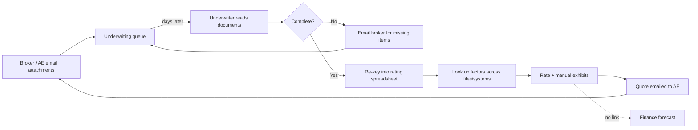

# Current State Quote Flow

```mermaid
flowchart LR
  B[Broker / AE email + attachments] --> Q[Underwriting queue]
  Q -->|days later| R[Underwriter reads documents]
  R --> G{Complete?}
  G -- No --> E[Email broker for missing items] --> Q
  G -- Yes --> X[Re-key into rating spreadsheet]
  X --> F[Look up factors across files/systems]
  F --> P[Rate + manual exhibits]
  P --> A[Quote emailed to AE] --> B
  P -.no link.-> FIN[Finance forecast]
```
