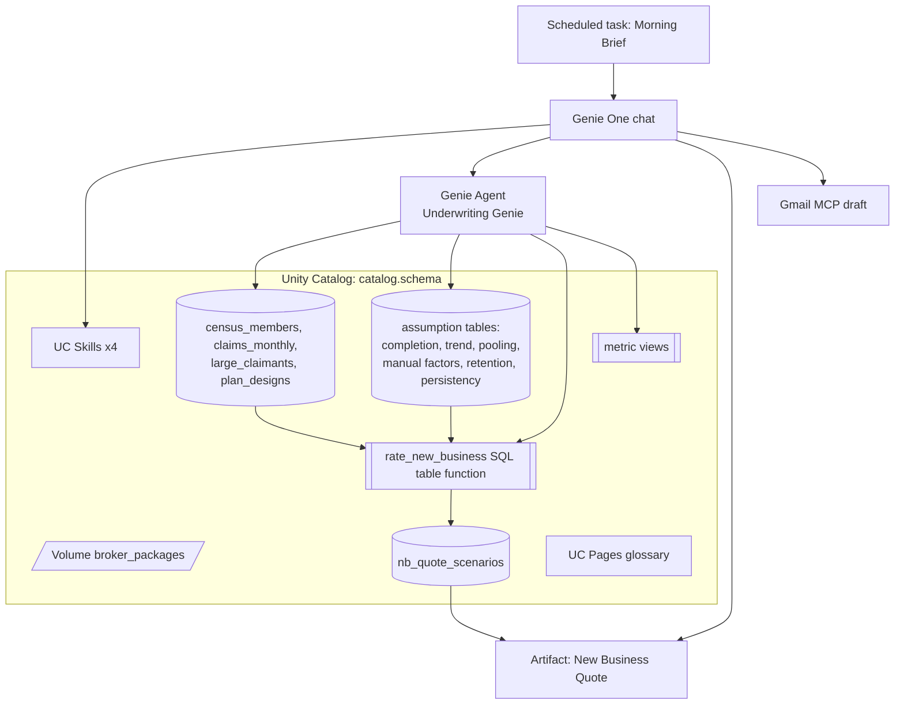

# Demo Architecture

```mermaid
flowchart TB
  subgraph UC[Unity Catalog: catalog.schema]
    V[/Volume broker_packages/]
    T1[(census_members, claims_monthly,<br/>large_claimants, plan_designs)]
    T2[(assumption tables:<br/>completion, trend, pooling,<br/>manual factors, retention, persistency)]
    FN[[rate_new_business SQL table function]]
    SC[(nb_quote_scenarios)]
    MV[[metric views]]
    PG[UC Pages glossary]
    SK[UC Skills x4]
  end
  GA[Genie Agent<br/>Underwriting Genie] --> T1 & T2 & FN & MV
  G1[Genie One chat] --> SK
  G1 --> GA
  G1 --> ART[Artifact: New Business Quote]
  G1 --> GM[Gmail MCP draft]
  ST[Scheduled task: Morning Brief] --> G1
  T1 & T2 --> FN --> SC --> ART
```
