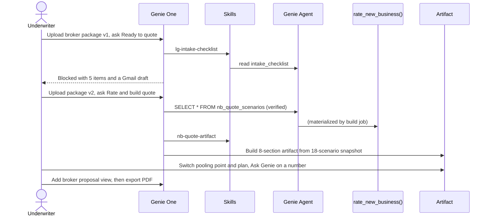

# Nb Quote Sequence

```mermaid
sequenceDiagram
  actor U as Underwriter
  participant G as Genie One
  participant S as Skills
  participant A as Genie Agent
  participant F as rate_new_business()
  participant R as Artifact
  U->>G: Upload broker package v1, ask Ready to quote
  G->>S: lg-intake-checklist
  S->>A: read intake_checklist
  G-->>U: Blocked with 5 items and a Gmail draft
  U->>G: Upload package v2, ask Rate and build quote
  G->>A: SELECT * FROM nb_quote_scenarios (verified)
  A->>F: (materialized by build job)
  G->>S: nb-quote-artifact
  G->>R: Build 8-section artifact from 18-scenario snapshot
  U->>R: Switch pooling point and plan, Ask Genie on a number
  U->>G: Add broker proposal view, then export PDF
```
