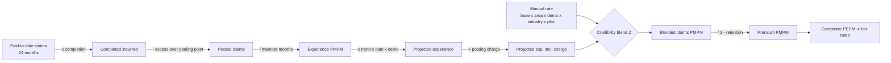

# Rating Waterfall Flow

```mermaid
flowchart LR
  A[Paid-to-date claims<br/>24 months] -->|x completion| B[Completed incurred]
  B -->|- excess over pooling point| C[Pooled claims]
  C -->|/ member months| D[Experience PMPM]
  D -->|x trend x plan x demo| E[Projected experience]
  E -->|+ pooling charge| F[Projected exp. incl. charge]
  M[Manual rate<br/>base x area x demo x industry x plan] --> Z
  F --> Z{Credibility blend Z}
  Z --> H[Blended claims PMPM]
  H -->|/ 1 - retention| P[Premium PMPM]
  P --> T[Composite PEPM -> tier rates]
```
