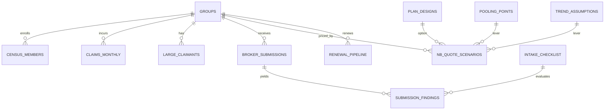

# Data Model Er

```mermaid
erDiagram
  GROUPS ||--o{ CENSUS_MEMBERS : enrolls
  GROUPS ||--o{ CLAIMS_MONTHLY : incurs
  GROUPS ||--o{ LARGE_CLAIMANTS : has
  GROUPS ||--o{ BROKER_SUBMISSIONS : receives
  GROUPS ||--o{ NB_QUOTE_SCENARIOS : priced_by
  GROUPS ||--o{ RENEWAL_PIPELINE : renews
  PLAN_DESIGNS ||--o{ NB_QUOTE_SCENARIOS : option
  POOLING_POINTS ||--o{ NB_QUOTE_SCENARIOS : lever
  TREND_ASSUMPTIONS ||--o{ NB_QUOTE_SCENARIOS : lever
  INTAKE_CHECKLIST ||--o{ SUBMISSION_FINDINGS : evaluates
  BROKER_SUBMISSIONS ||--o{ SUBMISSION_FINDINGS : yields
```
