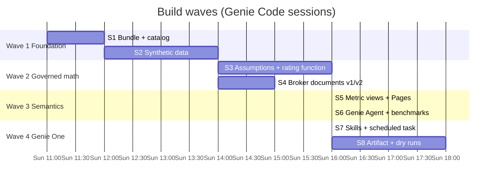

# Build Waves Gantt

```mermaid
gantt
  title Build waves (Genie Code sessions)
  dateFormat  YYYY-MM-DD HH:mm
  axisFormat  %a %H:%M
  section Wave 1 Foundation
  S1 Bundle + catalog          :s1, 2026-11-15 11:00, 1h
  S2 Synthetic data            :s2, after s1, 2h
  section Wave 2 Governed math
  S3 Assumptions + rating function :s3, after s2, 2h
  S4 Broker documents v1/v2    :s4, after s2, 1h
  section Wave 3 Semantics
  S5 Metric views + Pages      :s5, after s3, 1h30m
  S6 Genie Agent + benchmarks  :s6, after s5, 1h30m
  section Wave 4 Genie One
  S7 Skills + scheduled task   :s7, after s6, 1h30m
  S8 Artifact + dry runs       :s8, after s7, 2h
```
